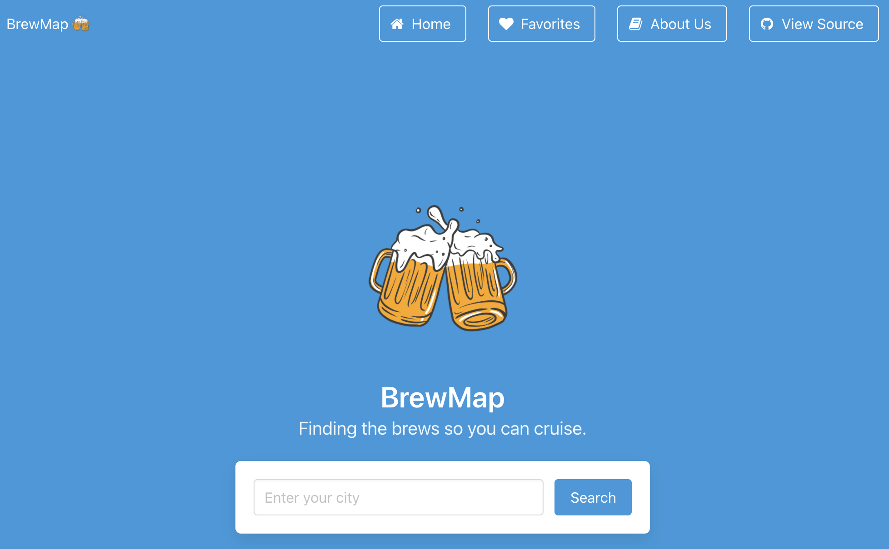

# BrewMap
## Decription
### Our Vision
The pandemic is finally over, your friends are all vaccinated and it’s time to grab some drinks at your local pubs. Just one brewery isn’t going to cut it - you want to do a full pubcrawl to celebrate the momentous occasion. What is close by? Where should we go first, second, third?

BrewMap is here to help! 

### Frong-End Development
The BrewMap project uses two server-side APIs to allow the user to locate breweries in a given city. The user is given an option to view the brewery website and/or add the brewery to favorites. The favorites tab uses client-side storage to list breweries added, persisting upon refresh. Users can clear their favorites at any time. 

## Technologies Used
* HTML
* CSS 
* CSS Framework[(Bluma)](https://github.com/BulmaTemplates/bulma-templates/blob/master/templates/landing.html)
* JavaScript
* Client-side local storage
* Server-side APIs (Open Brewery and Bing Maps)
* Modals
* Zoom and Google Slides (for remote collaboration and presentations)

## Screenshots

## Launch
Try out our application here:[BrewMap](https://telacaul.github.io/BrewMap/)

## About Us
* [Tela Caul](https://telacaul.github.io/professional-porfolio/)
* [Felicia Harris-Foster](https://)
* [Rich Brian Santos](https://)
* [Ian Osborne](https://)